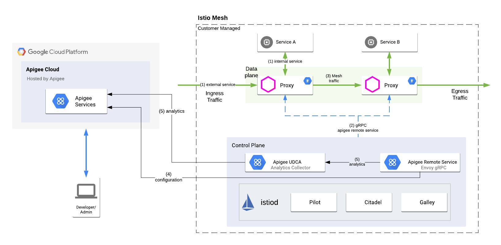
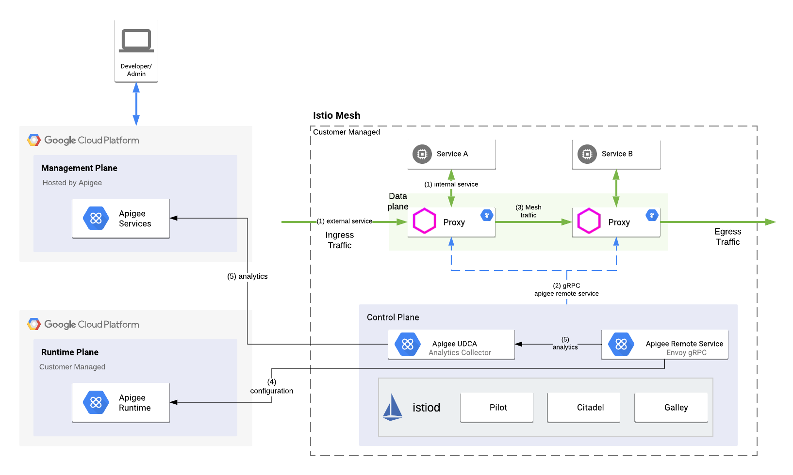

# Apigee Remote Service and Apigee UDCA

This repo contains instructions for how to setup [Apigee Remote Service](https://github.com/apigee/apigee-remote-service-envoy) and [Apigee UDCA](https://cloud.google.com/apigee/docs/hybrid/v1.2/data-collection-overview)

## Background

Apigee's adapter for Envoy provides customers with the ability to enforce API Management rules in an Istio service mesh. Read more about the concept [here](https://cloud.google.com/apigee/docs/api-platform/envoy-adapter/v1.0.x/concepts).

## Patterns

This repo will explore two patterns of using the Apigee adapter for Envoy with Apigee.

### Pattern 1 - with Apigee hybrid

The [documentation](https://cloud.google.com/apigee/docs/api-platform/envoy-adapter/v1.0.x/example-hybrid) shows how a customer can setup Apigee adapter for Envoy in the same cluster as Apigee hybrid.

This repo will explain how to set it up in a cluster where Apigee hybrid is not installed, but available in the same network. This picture describes the pattern



### Pattern 2 - with Apigee cloud

This pattern describes how to setup Apigee adapter for Envoy with Apigee SaaS (on the native GCP experience). Read more about setting up an Apigee instances [here](https://cloud.google.com/apigee/docs/api-platform/get-started/overview)

This repo will explain how to setup the Apgee adapter for Envoy in a cluster and have it connect to the runtime and control plane instances that are managed by Apigee.



## Setup Instructions

Both patterns requires similar steps to configure.

### Pre-requisites

* Kubernetes cluster v1.15+
* Apigee hybrid (in a separate cluster) or SaaS instance provisioned
* Apigee adapter for Envoy is provisioned on the org

### Steps

#### Overview

* `apigee-remote-service` - implements the gRPC interface for the Envoy ext_authz filter. This is responsible for policy decisions.
* `apigee-udca` - Collects usages/analytics data from `apigee-remote-service` and ships the usage data to the Apigee control plane.
* The communication between `apigee-remote-service` and `apigee-udca` is over mTLS over TCP. In this demostration we will use self signed certificates to secure the communication.
* The components will be installed in the `apigee` namespace.

#### Step 1 - Install cert-mananger

This setup will install [cert-mananger](https://cert-manager.io/docs/)

```bash
kubectl apply --validate=false -f https://github.com/jetstack/cert-manager/releases/download/v0.14.3/cert-manager.yaml
```

#### Step 2 - Generate a signing key pair

```bash
# Generate a CA private key
$ openssl genrsa -out ca.key 2048

# Create a self signed Certificate, valid for 10yrs with the 'signing' option set
$ openssl req -x509 -new -nodes -key ca.key -subj "/CN=${COMMON_NAME}" -days 3650 -reqexts v3_req -extensions v3_ca -out ca.crt
```

This will generate `ca.key` and `ca.crt` files.

#### Step 3 - Save the signing key pair as a Secret

Create the secret in the namespace where you install the components. Change `nandanks-serverless` to match your org name.

```bash
kubectl create secret tls nandanks-serverless-ca \
   --cert=ca.crt \
   --key=ca.key \
   --namespace=apigee
```

#### Step 4 - Creating an Issuer referencing the Secret

Create an issuer that uses the signing key pair stored in the secret from the previous command. Change `nandanks-serverless` to match your org name.

```bash
apiVersion: cert-manager.io/v1alpha2
kind: Issuer
metadata:
  name: nandanks-serverless-ca-issuer
  namespace: apigee
spec:
  ca:
    secretName: nandanks-serverless-ca
```

#### Step 5 - Install the Apigee UDCA component

Review the [apigee-udca.yaml](./apigee-udca.yaml) file. In this file, change occurances of `nandanks-serverless` to your org name and change the occurances of `prod1` to your environment name.

```bash
kubectl apply -f apigee-udca.yaml
```

#### Step 6 - Install the Apigee adapter for Envoy

Review the [apigee-remote-service.yaml](./apigee-remote-service.yaml) file. In this file, change occurances of `nandanks-serverless` to your org name and change the occurances of `prod1` to your environment name.

NOTE: The `ConfigMap` and `Secret` were generated from running the `apigee-remote-service-cli provision` command. Be sure to use the same.

```bash
kubectl apply -f apigee-remote-service.yaml
```

## Support

This is not an officially supported Google product
